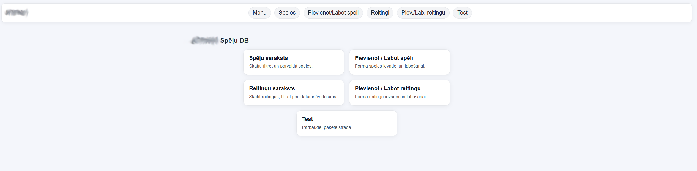
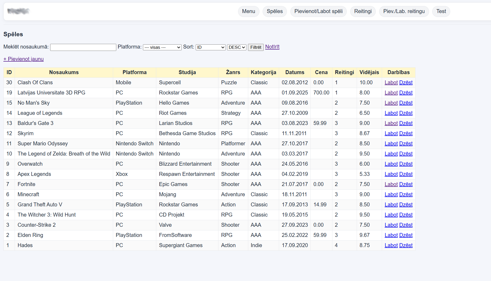
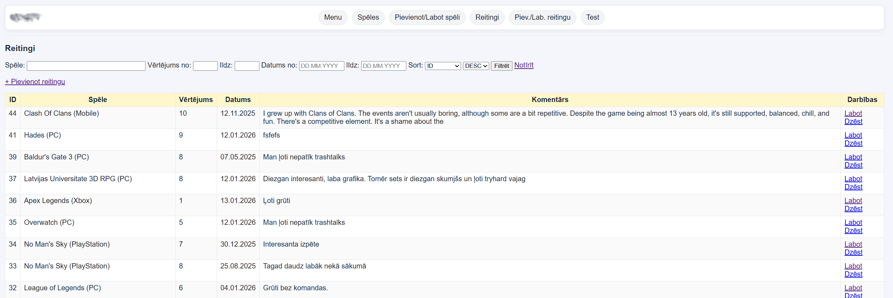
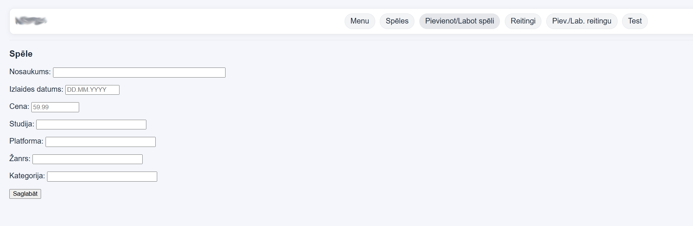

# Oracle Games DB

Small academic project built with Oracle SQL and PL/SQL.

The project models a simple games database and includes a package-based web UI for viewing, filtering, creating, editing, and deleting records.

## What It Includes

- relational schema for games, ratings, platforms, genres, categories, and studios
- demo data scripts for a full or smaller dataset
- PL/SQL package spec and body
- simple web interface built with Oracle Web Toolkit
- setup script for repeatable deployment

## Tech Stack

- Oracle SQL
- PL/SQL
- Oracle Web Toolkit (`HTP`, `HTF`, `OWA_UTIL`)
- jQuery UI autocomplete / datepicker

## Project Structure

- `schema.ddl` - main schema definition
- `insert.sql` - extended demo dataset
- `short_insert.sql` - smaller demo dataset
- `drop.sql` - drops all tables
- `delete.sql` - deletes data without dropping tables
- `patch_ddl.sql` - migration for older schema versions without `spele.cena`
- `speles_pkg.sql` - package specification
- `speles_pkg_body.sql` - package body
- `schema-diagram.png` - schema diagram
- `setup.sql` - one-shot setup script

## How To Run

1. Connect to an Oracle schema.
2. Run `setup.sql`.
3. Open `<YOUR_SCHEMA>.SPELES_PKG.MENU` through your PL/SQL web gateway.

You can also run the files manually in this order:

1. `schema.ddl`
2. `insert.sql` or `short_insert.sql`
3. `speles_pkg.sql`
4. `speles_pkg_body.sql`

## Notes

- `schema.ddl` already includes the `cena` column and its check constraint.
- Run `patch_ddl.sql` only when upgrading an older schema.
- The package builds links dynamically from the current schema, so it is easier to reuse under another Oracle user.

## Why It Is On GitHub

This repository is a small academic project that I keep as part of my portfolio. The goal is to show practical work with Oracle SQL, PL/SQL, database design, and basic CRUD-oriented web functionality.

